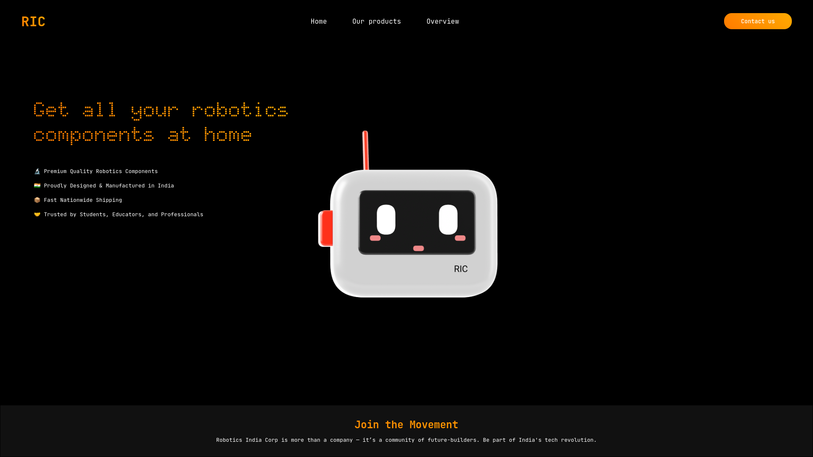

# 🌐 3D Landing Page with Spline, HTML & CSS

A modern and responsive landing page example built using pure **HTML** and **CSS**, featuring an interactive 3D model integrated from **[Spline](https://spline.design/)**.

## ✨ Features

- 🎨 Clean and responsive UI
- 🌈 Spline 3D model integration
- ⚡ Smooth scrolling and animations
- 💡 Easy to customize for your project

## 📸 Preview

## 🚀 Live Demo

[🔗 View Live](https://rishav-raj-sinha.github.io/spline_integrated_website/)

## 🛠️ Built With

- HTML5
- CSS3
- [Spline](https://spline.design)
model designed from scratch
